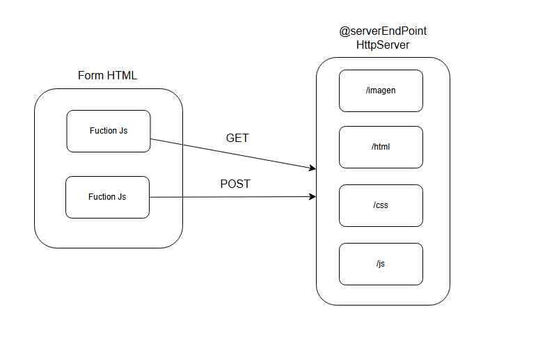
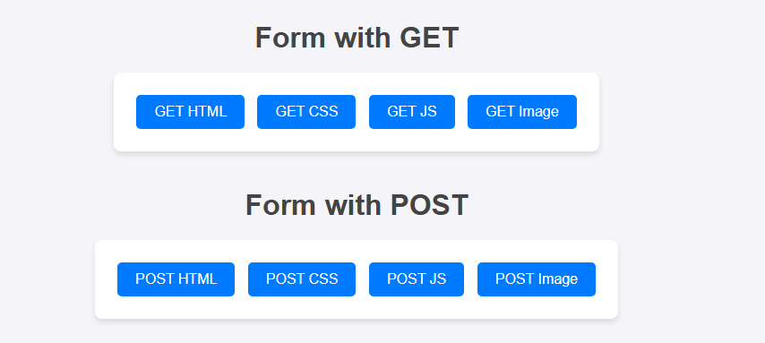

# Server Reader Anything

Use API´s for bring files with extentions .png .html .css .js save in the local disk.


## Getting Started

For clone this repository you use this command:
 ```
 git clone https://github.com/JffMv/Server_reader.git
 ```
### Prerequisites

Have installed:
maven 3.9.6 - [Install Maven](https://maven.apache.org/download.cgi#Installation)

git 2.44 - [Install Git](https://git-scm.com/book/en/v2/Getting-Started-Installing-Git)


java 21 - [Install Java](https://www.oracle.com/co/java/technologies/downloads/)

## Deployment

The process were building project maven with the command:

```
mvn archetype:generate -DgroupId=org.example -DartifactId=CALCULATOR -DarchetypeArtifactId=maven-archetype-quickstart -DinteractiveMode=false

```

Then we have verify the class App.java and the pom.xml, run the project with:

```
mvn package
```


## Architecture

### HttpServer:
Is one server that host several services API´s

### Form HTML
Host a simple form and functions javascript. Those functions call API´s

## Test
if you want run of test use this command:
```
mvn test
```
Test of server and API´s work


## How it see


## Built With

* [Java](https://www.java.com/es/) - The language used
* [Maven](https://maven.apache.org/) - Dependency Management
* [React](https://reactjs.org/) - Frontend framework
* [Git](http://git-scm.com/) - Version Control System


## Authors

* **Yeferson Mesa**

## License

This project is licensed under the MIT License - see the [LICENCE.md](LICENCE) file for details


java -cp "target/classes" co.edu.escuelaing.WebApplication controllers.GreetingController
